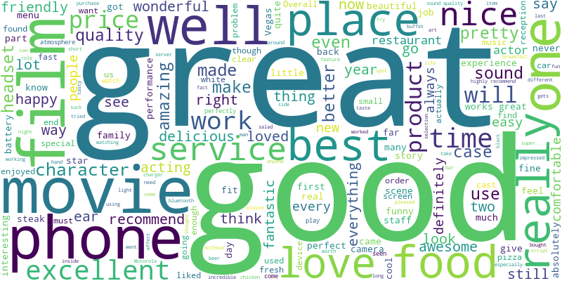
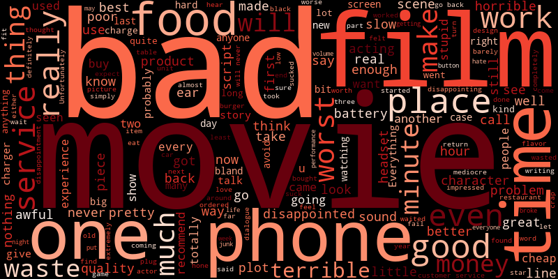

# Sentiment Classifier for Customer Feedback


[](https://customer-review-sentiment-classifier.streamlit.app/)

A machine learning project that classifies customer feedback as **positive** or **negative** using natural language processing techniques. Built using Logistic Regression and deployed as an interactive Streamlit web app.

---

## 🗂️ Project Folder Structure

```rust
sentiment-classifier/
│
├── data/                       
│    ├── amazon_cells_labelled.txt
│    ├── imdb_labelled.txt
│    ├── readme.txt
│    └── yelp_labelled.txt
│
├── docs/
│    └── word-cloud.png
│
├── notebooks/                  
│    └── 01_eda_and_modeling.ipynb
│
├── models/
│    ├── logistic_model.pkl
│    └── tfidf_vectorizer.pkl
│                     
├── app/                      
│    └── app.py
│
├── CONTRIBUTING.md
├── LICENSE
├── README.md
└── requirements.txt
```

---

## Overview

This project uses the [UCI Sentiment Labelled Sentences dataset](https://archive.ics.uci.edu/dataset/331/sentiment+labelled+sentences) to classify short customer reviews from Yelp, Amazon, and IMDB. The final application lets users input a sentence and instantly receive a **predicted sentiment** with model confidence.

---

## Demo


> 🔗 Coming soon: Live demo link (if hosted)

---

## 💡 Key Features

- Cleaned and explored labeled customer reviews (positive/negative)
- Trained and evaluated multiple models:
  - Logistic Regression ✅ (final model)
  - Multinomial Naive Bayes
  - Random Forest
- Visualized performance using bar plots
- Created word clouds for each sentiment class
- Built a simple and intuitive Streamlit app for real-time predictions

---

## Model Performance

| Model                   | Accuracy | Precision | Recall | F1 Score |
|------------------------|----------|-----------|--------|----------|
| Logistic Regression    | 0.836    | 0.837     | 0.818  | 0.828    |
| Multinomial Naive Bayes| 0.829    | 0.799     | 0.860  | 0.828    |
| Random Forest          | 0.809    | 0.833     | 0.754  | 0.791    |

Logistic Regression was chosen for deployment due to its balanced and reliable performance across all metrics.

---

## 📦 Installation

1. **Clone the repository:**

```bash
git clone https://github.com/mandele1999/sentiment-classifier.git
cd sentiment-classifier
```

2. **Install dependencies:**

```bash
pip install -r requirements.txt
```

3. **Run the app locally:**

```bash
streamlit run app/app.py
```

## Dataset

- Source: [UCI Sentiment Labelled Sentences dataset](https://archive.ics.uci.edu/dataset/331/sentiment+labelled+sentences)
- Size: 2,748 sentences across Yelp, Amazon, and IMDB
- Labels: 1 (positive), 0 (negative)

### Sample Predictions

```text
Sentence: "Absolutely terrible experience, never buying again."
Predicted Sentiment: Negative (0.95 confidence)

Sentence: "Customer service was quick and helpful."
Predicted Sentiment: Positive (0.92 confidence)
```

## Visual Insights

### 🌥️ Word Clouds

Positive Feedback              | Negative Feedback
:-----------------------------:|:-----------------------------:
 | 
Frequently used words in positive reviews | Common terms in negative reviews

## Project Summary

This project demonstrates how a simple yet powerful machine learning pipeline can be used to extract insights from customer feedback. It combines text preprocessing, model evaluation, and deployment—all in one place.

## ✨ Future Improvements

- Explore advanced models like DistilBERT or BERT
- Expand the dataset with more domain-specific reviews
- Add explanations for predictions using tools like LIME or SHAP
- Deploy on the web using Streamlit Community Cloud

## Acknowledgements

Thanks to UCI for providing a clean and simple dataset to work with. The project was created as part of a data science portfolio to demonstrate NLP and deployment capabilities.
